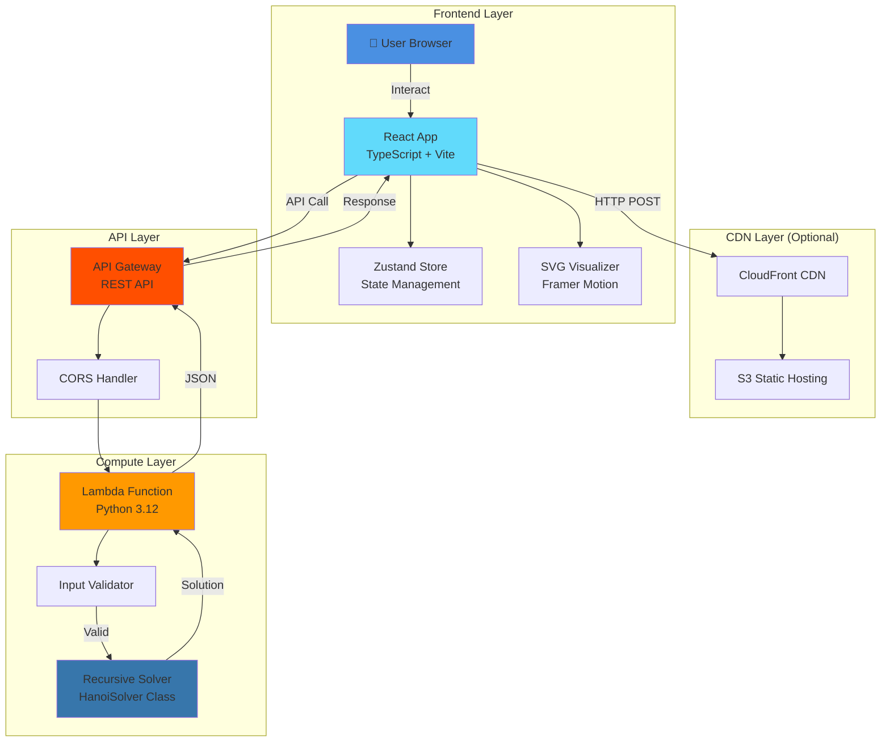
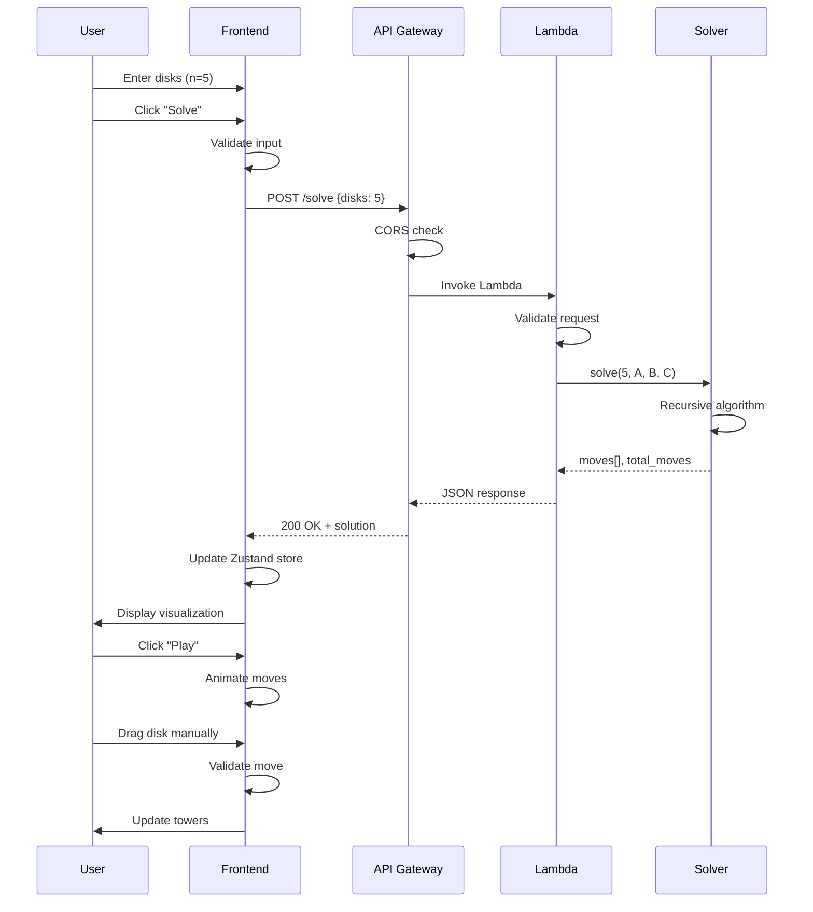

# 🗼 Tower of Hanoi - Architecture & Presentation Guide

## Architecture Diagram



## System Flow Diagram



## Component Architecture

```
┌─────────────────────────────────────────────────────────┐
│                        App.tsx                          │
│  ┌───────────────────────────────────────────────────┐  │
│  │      Header + API Health (Green/Red/Gray)       │  │
│  │      960px max-width, sticky positioning        │  │
│  └───────────────────────────────────────────────────┘  │
│  ┌───────────────────────────────────────────────────┐  │
│  │                Controls.tsx                       │  │
│  │  • Input (1-20 disks)                            │  │
│  │  • Solve button                                  │  │
│  │  • Playback controls (Play/Pause/Step)          │  │
│  │  • Speed selector                                │  │
│  │  • Progress bar                                  │  │
│  │  • 0.5rem padding, compact design               │  │
│  └───────────────────────────────────────────────────┘  │
│  ┌───────────────────────────────────────────────────┐  │
│  │            HanoiVisualizer.tsx                    │  │
│  │  ┌──────┐    ┌──────┐    ┌──────┐              │  │
│  │  │Rod A │    │Rod B │    │Rod C │              │  │
│  │  │ 💙 │    │     │    │     │  Cyan-Magenta   │  │
│  │  │ 💙 │    │     │    │     │  Gradient       │  │
│  │  │ 💙 │    │     │    │     │  17 Colors      │  │
│  │  │ 💜 │    │     │    │     │                │  │
│  │  │ 💜 │    │     │    │     │  Cyber Theme    │  │
│  │  └──────┘    └──────┘    └──────┘  Charcoal+Cyan  │  │
│  │  (Drag & Drop enabled - Framer Motion)          │  │
│  └───────────────────────────────────────────────────┘  │
│  ┌───────────────────────────────────────────────────┐  │
│  │               MovesList.tsx                       │  │
│  │  #1  Move disk 1 from A to C     [✓]            │  │
│  │  #2  Move disk 2 from A to B     [✓]            │  │
│  │  #3  Move disk 1 from C to B     [→]            │  │
│  │  #4  Move disk 3 from A to C     [ ]            │  │
│  │  (Scrollable, clickable to jump, 16rem height)  │  │
│  └───────────────────────────────────────────────────┘  │
│                                                         │
│         Zustand Store (hanoiStore.ts)                  │
│   • towers state • moves • playback • apiHealthy      │
│   • checkApiHealth() - polls every 30 seconds         │
│   • 100% inline styles (no className)                │
└─────────────────────────────────────────────────────────┘
```

## Number of Moves Table

| n (Disks) | Formula | Total Moves | Visual Scale | Time @ 1/sec |
|-----------|---------|-------------|--------------|--------------|
| 1         | 2^1-1   | 1           | ■            | 1 sec        |
| 2         | 2^2-1   | 3           | ■■■          | 3 sec        |
| 3         | 2^3-1   | 7           | ■■■■■■■      | 7 sec        |
| 4         | 2^4-1   | 15          | ■■■■■■■■■■■■■■■ | 15 sec    |
| 5         | 2^5-1   | 31          | [31 blocks]  | 31 sec       |
| 6         | 2^6-1   | 63          | [63 blocks]  | 1.05 min     |
| 7         | 2^7-1   | 127         | [127 blocks] | 2.12 min     |
| 8         | 2^8-1   | 255         | [255 blocks] | 4.25 min     |
| 9         | 2^9-1   | 511         | [511 blocks] | 8.52 min     |
| 10        | 2^10-1  | 1,023       | [1K blocks]  | 17.05 min    |
| 11        | 2^11-1  | 2,047       | [2K blocks]  | 34.12 min    |
| 12        | 2^12-1  | 4,095       | [4K blocks]  | 68.25 min    |
| 15        | 2^15-1  | 32,767      | [33K blocks] | 9.10 hours   |
| 20        | 2^20-1  | 1,048,575   | [1M blocks]  | 12.14 days   |

**Growth Pattern**: Each additional disk doubles the moves and adds 1  
**Legend**: Full list returned for n ≤ 12, count only for n > 12

---

## 📊 Presentation Slide Outline

### Slide 1: Title Slide
**Tower of Hanoi Solver**  
*Serverless Architecture Demo*

- Interactive puzzle solver
- AWS Lambda + React + TypeScript
- Visualize exponential complexity
- [Your Name] | [Date]

---

### Slide 2: The Classic Puzzle 🗼

**What is Tower of Hanoi?**

- Mathematical puzzle invented in 1883
- Three rods, n disks of different sizes
- Goal: Move all disks from source to target

**Rules:**
1. Only one disk at a time
2. Larger disk never on smaller
3. Only top disk can be moved

*"Simple rules, exponential complexity"*

---

### Slide 3: The Mathematics 📐

**Formula: 2^n - 1**

| Disks | Moves     | Real-world Time    |
|-------|-----------|-------------------|
| 3     | 7         | 7 seconds         |
| 5     | 31        | 31 seconds        |
| 10    | 1,023     | 17 minutes        |
| 20    | 1,048,575 | **12 days**       |
| 64    | 2^64-1    | 585 billion years |

**Legend**: 64 disks = "The Tower of Brahma"  
*When completed, the world will end (according to legend)*

---

### Slide 4: Technical Architecture 🏗️

```
┌──────────────┐
│   Frontend   │  React + TypeScript + Vite
│   (Vercel)   │  Inline Styles + Framer Motion
└──────┬───────┘  Zustand State Management
       │             API Health Monitoring
       │ HTTPS/REST
       ▼
┌──────────────┐
│ API Gateway  │  POST /solve
└──────┬───────┘  CORS Enabled
       │
       │ Invoke
       ▼
┌──────────────┐
│ AWS Lambda   │  Python 3.12
│   (Python)   │  Recursive Algorithm
└──────────────┘  < 1 second response
```

**Benefits:**
- Serverless (pay per request)
- Auto-scaling
- Global CDN
- Zero maintenance

---

### Slide 5: Key Features ⚡

**Backend:**
✅ Recursive solver algorithm  
✅ Smart response (full list ≤12, count only >12)  
✅ Input validation (1-20 disks)  
✅ Sub-second response time  

**Frontend:**
✅ Interactive drag & drop visualization  
✅ Step-by-step animation controls  
✅ Variable speed playback  
✅ Manual play mode with validation  
✅ Responsive mobile design  
✅ Cyber theme: cyan/charcoal color scheme  
✅ 17-color gradient disks (cyan→magenta)  
✅ API health monitoring with visual indicator  
✅ Click moves to jump to any state  
✅ 960px responsive layout  
✅ Click moves to jump to any state  

---

### Slide 6: Demo Time! 🎮

**Live Demo Components:**

1. **Check API health** - Show green indicator in top-right
2. **Solve 3 disks** - Show full solution
3. **Play animation** - Visualize algorithm
4. **Drag & drop** - Manual interaction (top disk only)
5. **Try 20 disks** - Show count-only response
6. **Speed control** - Fast playback
7. **Visual theme** - Point out cyan-to-magenta gradient

**Interactive Elements:**
- Real-time visualization
- 17-color gradient disks
- Cyber-themed towers with glow effects
- Smooth Framer Motion animations
- Progress tracking
- Compact, centered layout

---

### Slide 7: Technical Implementation 💻

**Backend (Python):**
```python
def solve(n, source, aux, target):
    if n == 1:
        moves.append(f"Move disk 1 from {source} to {target}")
        return
    solve(n-1, source, target, aux)
    moves.append(f"Move disk {n} from {source} to {target}")
    solve(n-1, aux, source, target)
```

**Frontend (React + TypeScript):**
- Type-safe state management with Zustand
- 100% inline styles (no CSS frameworks)
- Cyber theme: #00f2ff cyan + charcoal grays
- 17-color disk gradient (cyan→magenta)
- Optimized Framer Motion animations
- API health monitoring every 30 seconds
- Accessibility features

**Complexity:**
- Time: O(2^n)
- Space: O(n) recursion stack

---

### Slide 8: Deployment & DevOps 🚀

**Backend:**
```bash
sam build
sam deploy --guided
```
- Infrastructure as Code (SAM template)
- Automated deployment
- CloudFormation stack management

**Frontend:**
```bash
npm run build
vercel --prod
```
- Environment variable configuration
- CDN edge deployment
- Automatic HTTPS

**Monitoring:**
- CloudWatch Logs
- API Gateway metrics
- Lambda performance tracking

---

### Slide 9: Use Cases & Applications 🎯

**Educational:**
- Algorithm visualization
- Recursion teaching tool
- Complexity analysis demo

**Technical:**
- Serverless architecture example
- React best practices showcase
- API integration pattern

**Interview Prep:**
- Classic CS problem
- Recursion deep dive
- System design discussion

---

### Slide 10: Lessons Learned 📚

**What Worked:**
✅ Inline styles = Zero CSS conflicts  
✅ Framer Motion = Butter-smooth animations  
✅ Zustand for simple, effective state  
✅ SAM deployment = 5 minute setup  
✅ Type safety caught bugs early  
✅ API health polling provides confidence  

**Challenges:**
⚠️ Drag & drop coordinate mapping  
⚠️ Animation timing synchronization  
⚠️ CORS configuration initially  
⚠️ Balancing compactness with usability  

**Future Enhancements:**
🔮 Multiple algorithms (iterative, optimized)  
🔮 Save/share solutions (URL params)  
🔮 Customizable themes and colors  
🔮 Mobile touch optimization  
🔮 Animation replay controls  

---

### Slide 11: Cost Analysis 💰

**Monthly Estimates (1000 users, 10 solves each):**

| Service      | Usage          | Cost     |
|--------------|----------------|----------|
| Lambda       | 10K invocations| $0.20    |
| API Gateway  | 10K requests   | $0.04    |
| S3 + CF      | Static hosting | $1.00    |
| **Total**    |                | **$1.24**|

**Free Tier:**
- Lambda: 1M requests/month free
- API Gateway: 1M requests/month free
- S3: 5GB storage, 20K GET requests free

*Result: Essentially free for moderate traffic!*

---

### Slide 12: Q&A + Resources 🤝

**Live Project:**
- Frontend: https://tower-of-hanoi.vercel.app
- GitHub: https://github.com/yourusername/tower-of-hanoi
- API Docs: In README.md

**Tech Stack:**
- Backend: Python 3.12, AWS Lambda, SAM
- Frontend: React 18, TypeScript, Vite
- Styling: Inline styles (CSS-in-JS)
- Animation: Framer Motion
- State: Zustand
- Theme: Cyber (cyan #00f2ff + charcoal)
- Health: Auto-polling API monitor

**Questions?**

*Thank you for your attention!*

---

## Presentation Tips 🎤

1. **Start with demo** - Show the working application first
2. **Live interaction** - Let audience suggest disk numbers
3. **Highlight exponential growth** - Use the table to wow them
4. **Code walkthrough** - Show recursive elegance
5. **Cost comparison** - Compare to traditional hosting
6. **Mobile demo** - Show responsive design
7. **Error handling** - Try invalid input to show validation
8. **Animation speeds** - Demonstrate all speed options

## Demo Script 📝

1. **Open app** → Show clean, modern cyber-themed interface
2. **Check API health** → Point out green indicator in top-right
3. **Enter 3 disks** → Click Solve → Show immediate response
4. **Click Play** → Watch full animation at normal speed
5. **Change to Fast** → Show speed control
6. **Click move #2** → Demonstrate jump to state
7. **Drag a disk manually** → Show validation (can't place 5 on 3)
8. **Note visual theme** → Cyan-to-magenta gradient, cyber glow effects
9. **Reset** → Back to start
10. **Try 20 disks** → Show "count only" response
11. **Try 0 disks** → Show error handling
12. **Open DevTools** → Show API call with full request/response

Total demo time: 4-5 minutes
