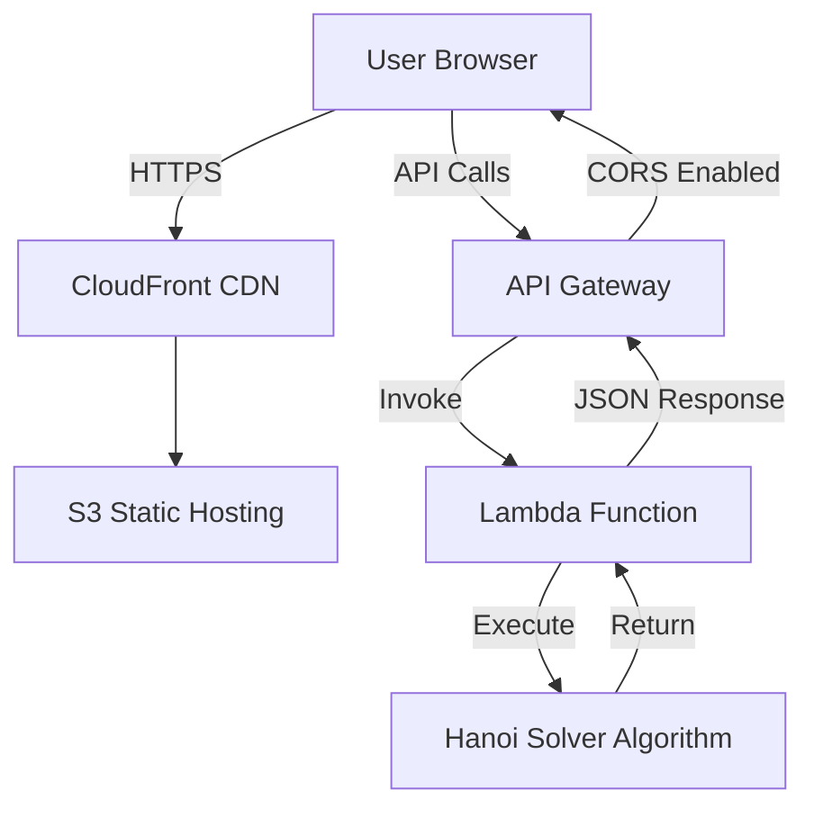

# 🗼 Tower of Hanoi - Serverless Application

A complete, production-ready Tower of Hanoi puzzle solver with an interactive React frontend and serverless AWS Lambda backend.


## 📋 Table of Contents

- [Features](#features)
- [Architecture](#architecture)
- [Tech Stack](#tech-stack)
- [Project Structure](#project-structure)
- [Prerequisites](#prerequisites)
- [Installation](#installation)
- [Backend Deployment](#backend-deployment)
- [Frontend Deployment](#frontend-deployment)
- [Local Development](#local-development)
- [API Documentation](#api-documentation)
- [Usage](#usage)
- [Complexity Analysis](#complexity-analysis)
- [Additional Documentation](#additional-documentation)

## ✨ Features

### Backend
- ✅ Recursive Tower of Hanoi solver algorithm
- ✅ AWS Lambda with Python 3.12 runtime
- ✅ REST API via API Gateway
- ✅ Configurable rod names
- ✅ Smart response handling (full list for n ≤ 12, count only for n > 12)
- ✅ Input validation and error handling
- ✅ CORS enabled for cross-origin requests
- ✅ Maximum 20 disks support

### Frontend
- ✅ Modern React 18 + TypeScript + Vite
- ✅ Interactive SVG visualization with drag & drop
- ✅ Smooth animations with Framer Motion
- ✅ State management with Zustand
- ✅ Step-by-step solution playback
- ✅ Variable animation speed control
- ✅ Click on moves to jump to that state
- ✅ Manual play mode with rule validation
- ✅ Responsive design (mobile-friendly)
- ✅ Inline style-based UI (no CSS frameworks)
- ✅ Cyber-themed design (cyan/charcoal color scheme)
- ✅ API health monitoring with visual indicator
- ✅ Gradient disk colors (cyan to magenta)
- ✅ Loading states and error handling
- ✅ 960px max-width responsive layout

## 🏗️ Architecture



## 🛠️ Tech Stack

### Backend
- **Runtime**: Python 3.12
- **Compute**: AWS Lambda
- **API**: API Gateway (REST)
- **Deployment**: AWS SAM (Serverless Application Model)

### Frontend
- **Framework**: React 18
- **Language**: TypeScript
- **Build Tool**: Vite
- **Styling**: Inline styles (CSS-in-JS)
- **Animation**: Framer Motion
- **State**: Zustand
- **Icons**: Lucide React
- **Theme**: Cyber (cyan #00f2ff, charcoal #1a1a1a-#3a3a3a)
- **Health Check**: Auto-polling every 30 seconds

## 📁 Project Structure

```
tower-of-hanoi/
├── backend/
│   ├── handler.py              # Lambda function handler
│   ├── template.yaml           # AWS SAM template
│   ├── requirements.txt        # Python dependencies (empty - stdlib only)
│   └── .gitignore
├── frontend/
│   ├── src/
│   │   ├── components/
│   │   │   ├── HanoiVisualizer.tsx    # SVG visualization + drag/drop
│   │   │   ├── MovesList.tsx          # Solution steps list
│   │   │   └── Controls.tsx           # Input & playback controls
│   │   ├── store/
│   │   │   └── hanoiStore.ts          # Zustand state management
│   │   ├── App.tsx                    # Main app component + API health
│   │   ├── main.tsx                   # React entry point
│   │   └── index.css                  # Global styles (minimal)
│   ├── index.html
│   ├── package.json
│   ├── vite.config.ts
│   ├── tsconfig.json
│   ├── .env.example
│   └── .gitignore
└── README.md
```

## 📦 Prerequisites

### Backend
- [AWS CLI](https://aws.amazon.com/cli/) configured with credentials
- [AWS SAM CLI](https://docs.aws.amazon.com/serverless-application-model/latest/developerguide/install-sam-cli.html)
- Python 3.12+

### Frontend
- Node.js 18+ and npm/yarn

## 🚀 Installation

### Clone the Repository

```bash
git clone https://github.com/yourusername/tower-of-hanoi.git
cd tower-of-hanoi
```

## 🔧 Backend Deployment

### Option 1: AWS SAM (Recommended)

1. **Navigate to backend directory**:
   ```bash
   cd backend
   ```

2. **Build the SAM application**:
   ```bash
   sam build
   ```

3. **Deploy with guided configuration** (first time):
   ```bash
   sam deploy --guided
   ```
   
   You'll be prompted for:
   - Stack Name: `tower-of-hanoi-stack`
   - AWS Region: `us-east-1` (or your preferred region)
   - Confirm changes before deploy: `Y`
   - Allow SAM CLI IAM role creation: `Y`
   - Disable rollback: `N`
   - Save arguments to samconfig.toml: `Y`

4. **Subsequent deployments**:
   ```bash
   sam deploy
   ```

5. **Get your API endpoint**:
   ```bash
   aws cloudformation describe-stacks \
     --stack-name tower-of-hanoi-stack \
     --query 'Stacks[0].Outputs[?OutputKey==`HanoiApiUrl`].OutputValue' \
     --output text
   ```

### Option 2: Manual Lambda Deployment

1. **Create Lambda function via AWS Console**:
   - Runtime: Python 3.12
   - Handler: `handler.lambda_handler`
   - Upload `handler.py` as code

2. **Create API Gateway**:
   - Type: REST API
   - Create resource: `/solve`
   - Create method: `POST`
   - Integration: Lambda Function
   - Enable CORS

3. **Deploy API** and note the invoke URL

### Testing the Backend

```bash
# Test with curl
curl -X POST https://your-api-url/prod/solve \
  -H "Content-Type: application/json" \
  -d '{"disks": 3}'

# Expected response
{
  "total_moves": 7,
  "moves": [
    "Move disk 1 from A to C",
    "Move disk 2 from A to B",
    ...
  ],
  "formula": "2^n - 1",
  "n": 3,
  "generated_at": "2026-01-11T12:00:00Z"
}
```

## 🌐 Frontend Deployment

### Local Development

1. **Navigate to frontend directory**:
   ```bash
   cd frontend
   ```

2. **Install dependencies**:
   ```bash
   npm install
   ```

3. **Create environment file**:
   ```bash
   cp .env.example .env.local
   ```

4. **Edit `.env.local` with your API endpoint**:
   ```env
   VITE_API_URL=https://your-api-id.execute-api.us-east-1.amazonaws.com/prod/solve
   ```

5. **Start development server**:
   ```bash
   npm run dev
   ```

6. **Open browser**: http://localhost:3000

### Production Deployment

#### Option 1: Vercel (Recommended)

```bash
# Install Vercel CLI
npm i -g vercel

# Deploy
cd frontend
vercel --prod

# Set environment variable in Vercel dashboard
# VITE_API_URL = your-lambda-api-url
```

#### Option 2: Netlify

```bash
# Install Netlify CLI
npm i -g netlify-cli

# Build
npm run build

# Deploy
netlify deploy --prod --dir=dist

# Set environment variable in Netlify dashboard
```

#### Option 3: AWS S3 + CloudFront

```bash
# Build
npm run build

# Create S3 bucket
aws s3 mb s3://tower-of-hanoi-frontend

# Enable static website hosting
aws s3 website s3://tower-of-hanoi-frontend \
  --index-document index.html \
  --error-document index.html

# Upload files
aws s3 sync dist/ s3://tower-of-hanoi-frontend --delete

# Make public (or use CloudFront)
aws s3api put-bucket-policy --bucket tower-of-hanoi-frontend \
  --policy '{
    "Version": "2012-10-17",
    "Statement": [{
      "Sid": "PublicReadGetObject",
      "Effect": "Allow",
      "Principal": "*",
      "Action": "s3:GetObject",
      "Resource": "arn:aws:s3:::tower-of-hanoi-frontend/*"
    }]
  }'

# Access at: http://tower-of-hanoi-frontend.s3-website-us-east-1.amazonaws.com
```

## 📡 API Documentation

### Endpoint

```
POST /solve
```

### Request

```json
{
  "disks": 5,           // Required: 1-20
  "source": "A",        // Optional: default "A"
  "auxiliary": "B",     // Optional: default "B"
  "target": "C"         // Optional: default "C"
}
```

### Response (n ≤ 12)

```json
{
  "total_moves": 31,
  "moves": [
    "Move disk 1 from A to C",
    "Move disk 2 from A to B",
    ...
  ],
  "formula": "2^n - 1",
  "n": 5,
  "generated_at": "2026-01-11T12:00:00Z"
}
```

### Response (n > 12)

```json
{
  "total_moves": 1048575,
  "moves": [],
  "message": "Full list too large - showing move count only",
  "formula": "2^n - 1",
  "n": 20,
  "generated_at": "2026-01-11T12:00:00Z"
}
```

### Error Response

```json
{
  "error": "Too many disks",
  "message": "Maximum 20 disks allowed (20 disks = 1,048,575 moves)"
}
```

## 🎮 Usage

1. **Check API health** - Green indicator in top-right shows API is ready
2. **Select number of disks** (1-20) using the input field
3. **Click "Solve Puzzle"** to get the solution from the backend
4. **Watch the animation** by clicking "Play"
5. **Control playback**:
   - Play/Pause: Start or stop animation
   - Back/Forward: Step through moves manually
   - Speed: Adjust animation speed (Slow/Normal/Fast/Very Fast)
   - Reset: Return to initial state
6. **Interactive mode**:
   - Drag disks between rods manually (only top disk can be moved)
   - Click on any move in the list to jump to that state
   - Rules are validated (can't place larger disk on smaller)
7. **Visual features**:
   - 17-color gradient disks (cyan to magenta)
   - Cyber-themed towers with cyan glow effects
   - Smooth Framer Motion animations
   - Compact, centered 960px layout

## 📊 Complexity Analysis

| Disks (n) | Total Moves (2^n - 1) | Time @ 1 move/sec |
|-----------|----------------------|-------------------|
| 3         | 7                    | 7 seconds         |
| 5         | 31                   | 31 seconds        |
| 7         | 127                  | 2.1 minutes       |
| 10        | 1,023                | 17 minutes        |
| 12        | 4,095                | 68 minutes        |
| 15        | 32,767               | 9.1 hours         |
| 20        | 1,048,575            | 12.1 days         |

**Algorithm**: Classic recursive divide-and-conquer approach  
**Time Complexity**: O(2^n)  
**Space Complexity**: O(n) for recursion stack  

## 🔐 CORS Configuration

The API Gateway is configured with CORS headers:

```yaml
Cors:
  AllowMethods: "'POST,OPTIONS'"
  AllowHeaders: "'Content-Type,X-Amz-Date,Authorization,X-Api-Key,X-Amz-Security-Token'"
  AllowOrigin: "'*'"
```

For production, restrict `AllowOrigin` to your frontend domain:

```yaml
AllowOrigin: "'https://your-frontend-domain.com'"
```

## 🐛 Troubleshooting

### Backend Issues

**Problem**: Lambda timeout  
**Solution**: Function should complete quickly (< 1 second for n=20)

**Problem**: CORS errors  
**Solution**: Ensure CORS is enabled in API Gateway and headers are set in Lambda

### Frontend Issues

**Problem**: API calls fail  
**Solution**: Check VITE_API_URL in .env.local and ensure API is deployed. Watch the health indicator in the top-right.

**Problem**: Blank page  
**Solution**: Check browser console for errors, ensure all dependencies installed

**Problem**: API health shows red/down  
**Solution**: Verify backend Lambda is deployed and API Gateway endpoint is correct in VITE_API_URL

**Problem**: Drag and drop not working  
**Solution**: Only the top disk on each rod can be dragged. Ensure you're selecting the topmost disk.

**Problem**: Styles not applying  
**Solution**: All styles are inline - no external CSS needed. Clear browser cache and rebuild.

## 📝 License

MIT License - feel free to use for learning and projects!

## 👨‍💻 Author

Built as a demonstration of serverless architecture and modern React development.

## 🙏 Acknowledgments

- Classic Tower of Hanoi puzzle by Édouard Lucas (1883)
- AWS Serverless Application Model
- React and TypeScript communities

## 📚 Additional Documentation

- **[QUICKSTART.md](QUICKSTART.md)** - 5-minute setup guide
- **[ARCHITECTURE.md](ARCHITECTURE.md)** - Deep dive into system design + presentation guide
- **[DEPLOYMENT-AWS.md](DEPLOYMENT-AWS.md)** - Complete AWS deployment instructions
- **[STYLING.md](STYLING.md)** - Inline styles guide and patterns
- **[CHANGELOG.md](CHANGELOG.md)** - Version history and changes

---

**⭐ Star this repo if you find it helpful!**
